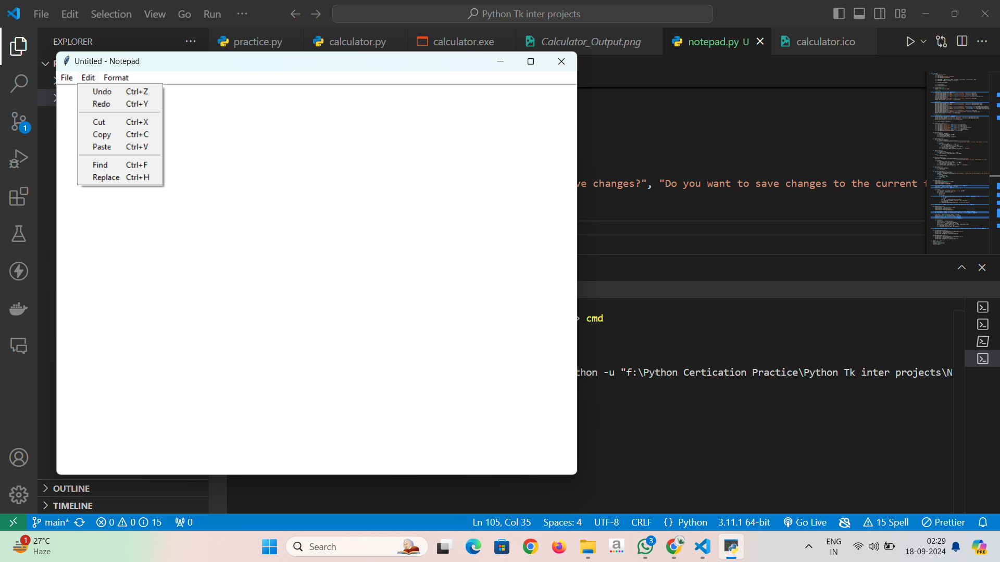
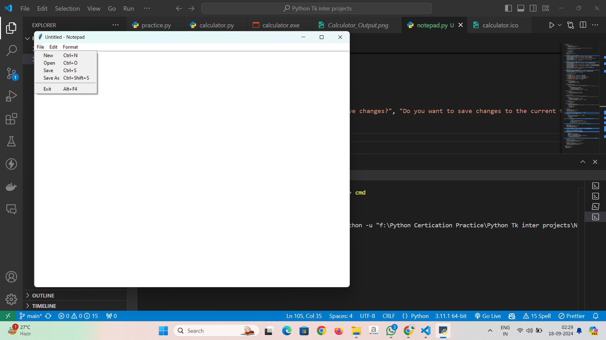
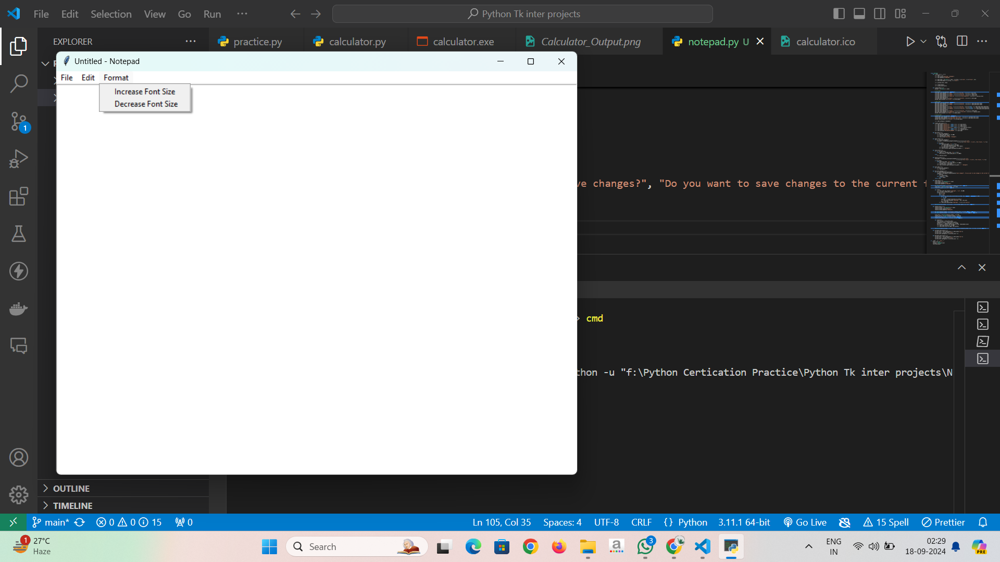

# Notepad Clone using Tkinter

This is a simple Notepad clone created using Python's Tkinter library. It replicates many of the basic features found in the Windows Notepad, such as creating, opening, saving, and editing text files, along with additional features like find, replace, and adjusting the font size.

## Features
- **File Operations**:
  - New File
  - Open File
  - Save File
  - Save As
  - Exit

- **Edit Operations**:
  - Undo, Redo
  - Cut, Copy, Paste
  - Find & Replace Text

- **Formatting**:
  - Increase/Decrease Font Size

- **Keyboard Shortcuts**:
  - `Ctrl+N`: New File
  - `Ctrl+O`: Open File
  - `Ctrl+S`: Save File
  - `Ctrl+Shift+S`: Save As
  - `Ctrl+Z`: Undo
  - `Ctrl+Y`: Redo
  - `Ctrl+F`: Find Text
  - `Ctrl+H`: Replace Text
  - `Alt+F4`: Exit the Application

## Screenshots

### 1. 


### 2. 


### 3. 


## Installation & Usage

1. Navigate to the project directory:
   ```bash
   cd notepad-clone
   ```

2. Run the script:
   ```bash
   python notepad.py
   ```

### Prerequisites
Make sure you have Python 3.x installed along with Tkinter, which is usually bundled with Python. If not, you can install it via:
```bash
pip install tk
```

## Customization
You can modify or extend this Notepad by adding additional features like syntax highlighting, opening recent files, or integrating a spell checker.

## Contributing
If you wish to contribute to this project, feel free to fork the repository and submit a pull request.

